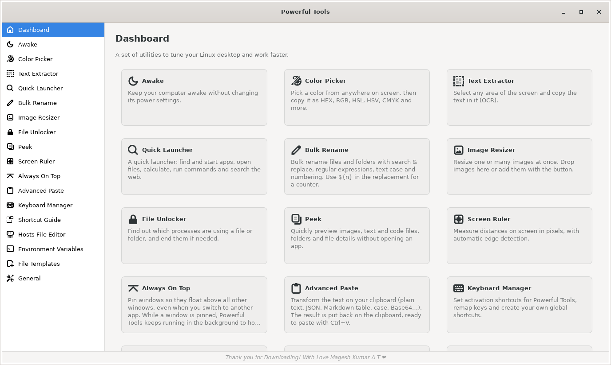
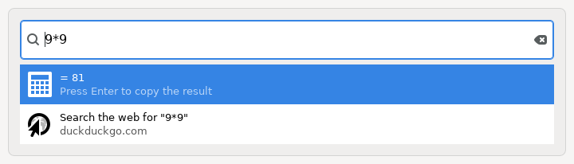
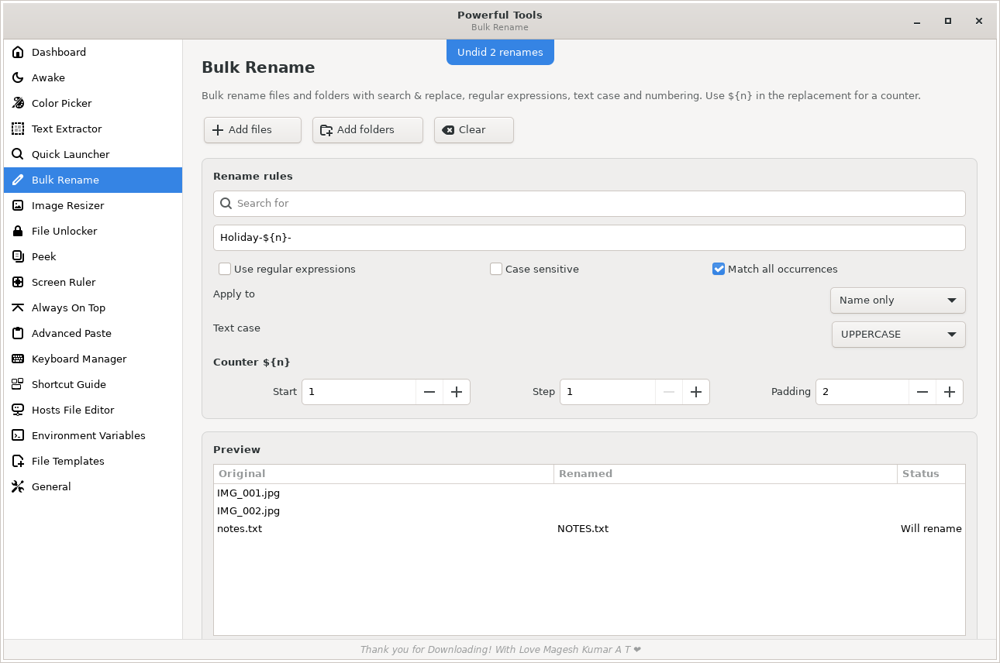
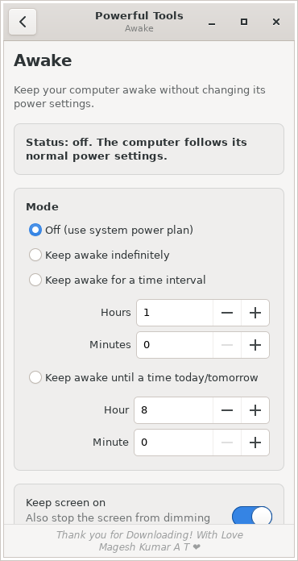

<p align="center">
  
</p>

<h1 align="center">Powerful Tools</h1>

<p align="center">
  <b>16 everyday power-user utilities for the Linux desktop, in one small app.</b><br>
  Free and open source · MIT License · Ubuntu 18.04 and newer
</p>

<p align="center">
  <a href="https://github.com/maggimagesh/powerful-tools/releases/latest"></a>
  <a href="https://github.com/maggimagesh/powerful-tools/actions/workflows/ci.yml"></a>
  <a href="LICENSE"></a>
</p>



Hi, I'm **Magesh Kumar A T**. I built Powerful Tools because I wanted the little helpers I use every
day (picking a color from the screen, copying text out of an image, renaming a hundred photos at once,
keeping my laptop awake during a long download) to live in one tidy, lightweight app on Linux.
Everything runs locally on your computer. No accounts, no tracking, no internet needed
(except the optional web search in Quick Launcher).

Thank you for downloading! ❤

---

## What's inside

| Tool | What it does for you |
|---|---|
| ☕ **Awake** | Keeps your computer from sleeping: indefinitely, for a set time, or until a time you choose. Your power settings are never changed. |
| 🎨 **Color Picker** | Click anywhere on screen to grab a color, with a zoom loupe for pixel precision. Copies HEX, RGB, HSL, HSV, CMYK and more, and keeps a history. |
| 🔤 **Text Extractor** | Drag a box around any text on screen (a picture, a video, a locked PDF) and it's copied to your clipboard. |
| 🚀 **Quick Launcher** | One search box for apps, files (`~/…`), a calculator (`= 2*(3+4)`), terminal commands (`> command`), web search (`?? words`) and lock / suspend / log out. |
| ✏️ **Bulk Rename** | Rename many files at once with search & replace, regular expressions, text case and numbering (`${n}`). Live preview and **undo**. |
| 🖼️ **Image Resizer** | Resize a batch of images to presets or custom sizes, with fit, fill or stretch, and PNG/JPEG output. |
| 🔓 **File Unlocker** | "This file is in use"? See exactly which programs are using a file or folder, and close them. |
| 👁️ **Peek** | Instantly preview images, text and code files, and folder contents without opening an app. |
| 📏 **Screen Ruler** | Measure anything on screen in pixels. Edges are detected automatically. |
| 📌 **Always On Top** | Pin any window so it floats above everything else, even while you work in other apps. |
| 📋 **Advanced Paste** | Turn clipboard text into clean plain text, pretty or minified JSON, a Markdown table, UPPER/lower case, Base64, URL-encoded text, and more. |
| ⌨️ **Keyboard Manager** | Give every tool a global shortcut, remap keys (e.g. Caps Lock → Esc) and create your own shortcuts. |
| ❔ **Shortcut Guide** | Every keyboard shortcut of your desktop in one searchable list. |
| 🌐 **Hosts File Editor** | Add, enable or disable entries in `/etc/hosts` with a simple table. |
| 🧩 **Environment Variables** | Manage your personal environment variables safely, no terminal needed. |
| 📄 **File Templates** | Create files from your own templates. They also appear in the file manager's right-click "New Document" menu. |
| ⚙️ **General** | Light/dark theme and right-click integration for Files (Nautilus), Nemo and Caja. |

<p align="center">
  <br>
  
  
</p>

The window adapts to any screen, from a 360 px wide window up to 4K. On narrow screens the sidebar turns
into a list with a back button.

---

## Install

**Works on:** Ubuntu 18.04, 20.04, 22.04, 24.04 and newer, plus Ubuntu-based distributions such as
Linux Mint, Pop!_OS, elementary OS and Zorin OS, and it should also work on Debian 10 or newer (not part of
the automated tests). It works on any processor (Intel, AMD, ARM).

1. Download **`powerful-tools_1.0.0_all.deb`** from the
   [latest release](https://github.com/maggimagesh/powerful-tools/releases/latest).
2. Install it. On most systems you can double-click the file to open it in your software installer, or run:

   ```bash
   cd ~/Downloads
   sudo apt install ./powerful-tools_1.0.0_all.deb
   ```

3. Open **Powerful Tools** from your applications menu, or type `powerful-tools` in a terminal.

The password prompt during installation is Linux's normal rule for installing any app. After that,
Powerful Tools runs as your normal user. It only asks for your password again for the two actions where
Linux itself requires administrator rights: saving `/etc/hosts`, and closing programs that belong to
another user.

> **Tip:** if apt prints *"Download is performed unsandboxed as root"*, that's harmless. It only means
> the file sits in a private folder. Moving the `.deb` to `/tmp` first makes the note go away.

### Uninstall

```bash
sudo apt remove powerful-tools
```

Your personal settings stay in `~/.config/powerful-tools`. Delete that folder too for a completely
clean removal.

---

## Using it

### Global keyboard shortcuts
Open **Keyboard Manager** and click **Enable** next to a tool. Suggested shortcuts:

| Tool | Shortcut |
|---|---|
| Quick Launcher | `Ctrl` + `Alt` + `Space` |
| Color Picker | `Super` + `Shift` + `C` |
| Text Extractor | `Super` + `Shift` + `T` |
| Screen Ruler | `Super` + `Shift` + `M` |
| Always On Top (focused window) | `Ctrl` + `Super` + `T` |
| Advanced Paste | `Super` + `Shift` + `V` |

On GNOME-based desktops (Ubuntu, Pop!_OS, Zorin, Budgie) shortcuts are registered automatically.
On other desktops, add them in your system keyboard settings using the commands shown on the page.

### Right-click menu in your file manager
In **General → File manager integration**, click **Install**. Then right-click files and choose
**Scripts → Powerful Tools Image Resizer / Bulk Rename / File Unlocker / Peek**.

### Command line

```text
powerful-tools                    open the app
powerful-tools --run              Quick Launcher
powerful-tools --pick-color       Color Picker
powerful-tools --text-extract     Text Extractor
powerful-tools --ruler            Screen Ruler
powerful-tools --always-on-top    pin/unpin the focused window
powerful-tools --rename FILES…    Bulk Rename      (also --resize, --unlocker, --peek)
powerful-tools --page hosts       open any tool page
powerful-tools --help             all options
```

---

## Good to know

- **Wayland vs X11.** The screen tools (Color Picker, Text Extractor, Screen Ruler) work on both. On
  Wayland your desktop may ask once for permission to take screenshots. **Always On Top** can pin other
  apps' windows on X11 ("Ubuntu on Xorg" at the login screen). On Wayland, Linux doesn't allow apps to do
  this, so the page shows your desktop's built-in way instead (GNOME: `Alt`+`Space` → *Always on Top*).
- **Always On Top keeps working in the background.** While a window is pinned, Powerful Tools keeps
  running so browsers and editors can't knock the window down. Unpin everything and it exits normally.
- **Text Extractor languages.** English is installed by default. Add more with, for example,
  `sudo apt install tesseract-ocr-deu` (German) or `tesseract-ocr-hin` (Hindi).
- **Environment variables** are saved in `~/.profile` and apply after you log out and back in.
- **Privacy.** Nothing is uploaded anywhere. Settings live in `~/.config/powerful-tools/settings.json`.

## Troubleshooting

| Problem | Fix |
|---|---|
| Text Extractor says the OCR engine is missing | `sudo apt install tesseract-ocr tesseract-ocr-eng` |
| Always On Top shows instructions instead of a window list | You're on Wayland (see above), or run `sudo apt install wmctrl x11-utils` |
| A shortcut doesn't react | Another app may use the same keys. Choose a different one in Keyboard Manager. |
| Something else | Please [open an issue](https://github.com/maggimagesh/powerful-tools/issues) with your Ubuntu version and what you did. |

---

## For developers

Powerful Tools is plain **Python 3 + GTK 3** (via PyGObject), with no compiled code and no bundled
libraries.

```bash
git clone https://github.com/maggimagesh/powerful-tools.git
cd powerful-tools
bin/powerful-tools                 # run from source (needs python3-gi, python3-gi-cairo, gir1.2-gtk-3.0)
python3 tests/test_logic.py        # fast unit tests
tests/run_gui.sh                   # full GUI test in a virtual display (needs xvfb)
./build.sh                         # builds dist/powerful-tools_<version>_all.deb
tests/docker_test.sh 18.04         # installs the .deb in a clean Ubuntu container and tests everything
```

See [CONTRIBUTING.md](CONTRIBUTING.md) for the project layout and guidelines.

## License

Powerful Tools is released under the [MIT License](LICENSE). You're free to use, share and modify it.

It is an independent project with its own original code, name and icon. It doesn't bundle any
third-party code. The system components it uses are installed separately by your package manager
under their own open-source licenses:

| Component | Used for | License |
|---|---|---|
| Python 3 | runtime | PSF License |
| GTK 3, GdkPixbuf, PyGObject, pycairo | user interface | LGPL-2.1+ (pycairo: LGPL-2.1 / MPL-1.1) |
| Tesseract OCR (optional) | Text Extractor | Apache-2.0 |
| wmctrl, xprop (optional) | Always On Top on X11 | GPL-2.0+ / MIT |
| polkit `pkexec` (optional) | admin-only actions | LGPL-2.0+ |

---

<p align="center"><sub>Thank you for downloading! With love, Magesh Kumar A T ❤</sub></p>
